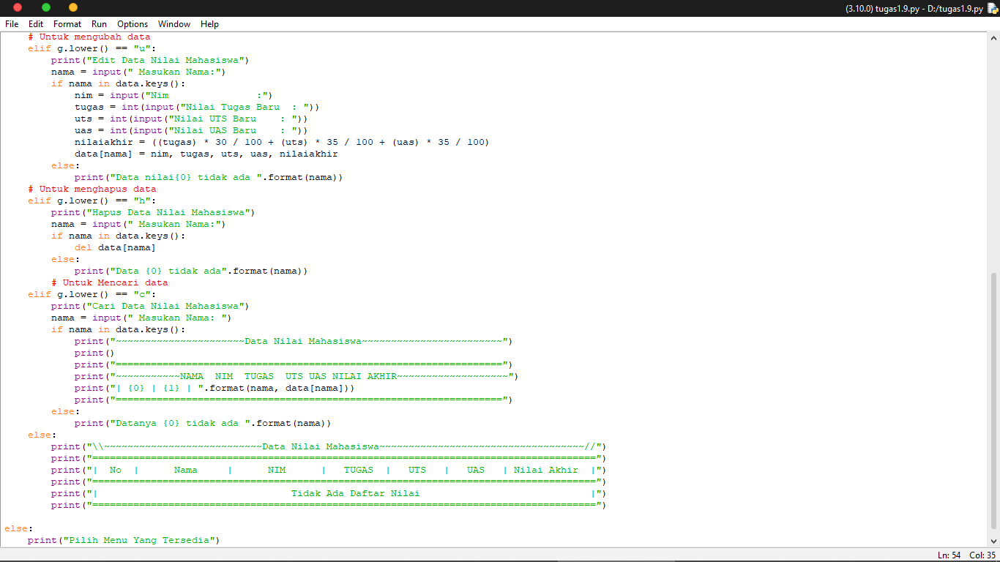

# tugas 11
Buat program sederhana dengan mengaplikasikan penggunaan fungsi yang akan menampilkan daftar nilai mahasiswa, dengan ketentuan sebagai berikut:
1. Fungsi tambah() untuk menambah data 
2. Fungsi tapilkan() untuk menampilkan data 
3. Fungsi hapus(nama) untuk menghapus data berdasarkan nama 
4. Fungsi ubah(nama) untuk mengubah data berdasarkan nama 
5. Buat flowchart dan penjelasan programnya pada README.md.  
6. Commit dan push repository ke github.

    * Untuk keluar dari program
    if g.lower() == "k":
        print("Keluar dari program")
        break
    * Untuk melihat list
    elif g.lower() == "l":
        if data.items():
    *  Untuk menambahkan data
    elif g.lower() == "t":
        print("Tambah Data")
        nama = input("Nama          : ")
        nim = int(input("NIM           : "))
        tugas = int(input("Tugas         : "))
        uts = int(input("Nilai UTS     : "))
        uas = int(input("Nilai UAS     : "))
        nilaiakhir = ((tugas) * 30 / 100 + (uts) * 35 / 100 + (uas) * 35 / 100)
        data[nama] = nim, tugas, uts, uas, nilaiakhir
    * Untuk mengubah data
    elif g.lower() == "u":
        print("Edit Data Nilai Mahasiswa")
        nama = input(" Masukan Nama:")
        if nama in data.keys():
            nim = input("Nim               :")
            tugas = int(input("Nilai Tugas Baru  : "))
            uts = int(input("Nilai UTS Baru    : "))
            uas = int(input("Nilai UAS Baru    : "))
            nilaiakhir = ((tugas) * 30 / 100 + (uts) * 35 / 100 + (uas) * 35 / 100)
            data[nama] = nim, tugas, uts, uas, nilaiakhir
        else:
            print("Data nilai{0} tidak ada ".format(nama))
    * Untuk menghapus data
    elif g.lower() == "h":
        print("Hapus Data Nilai Mahasiswa")
        nama = input(" Masukan Nama:")
        if nama in data.keys():
            del data[nama]
        else:
            print("Data {0} tidak ada".format(nama))
    * Untuk Mencari data
    elif g.lower() == "c":
        print("Cari Data Nilai Mahasiswa")
        nama = input(" Masukan Nama: ")
        if nama in data.keys():
            
## Hasil Program
1. Proses/srcip coding 

2. Hasil/output program 

### Terimakasih
